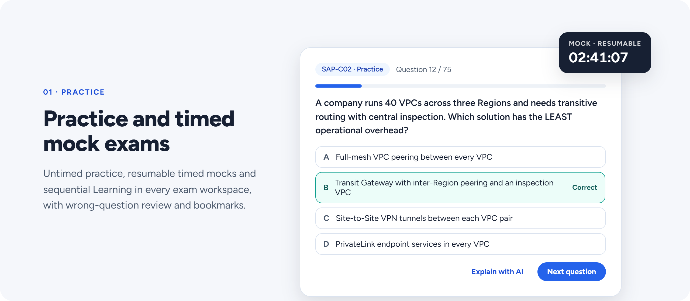
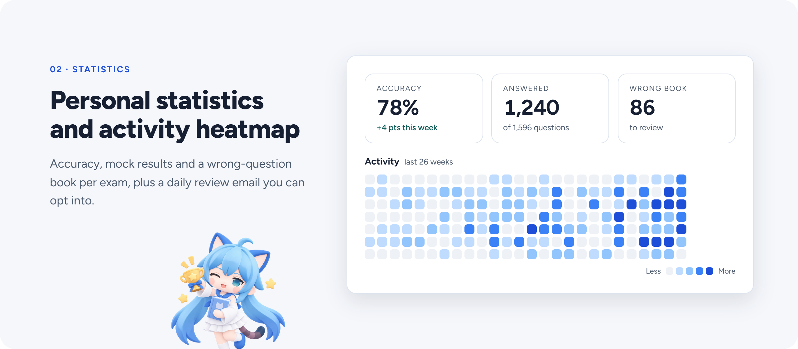
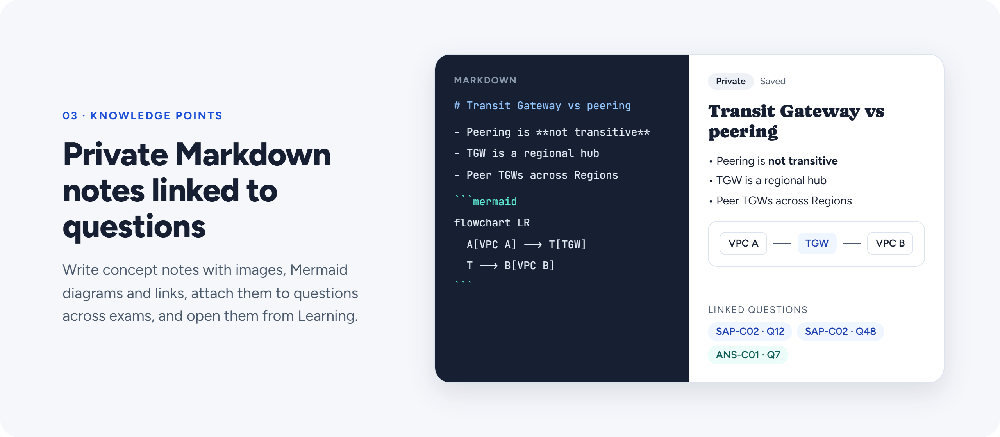
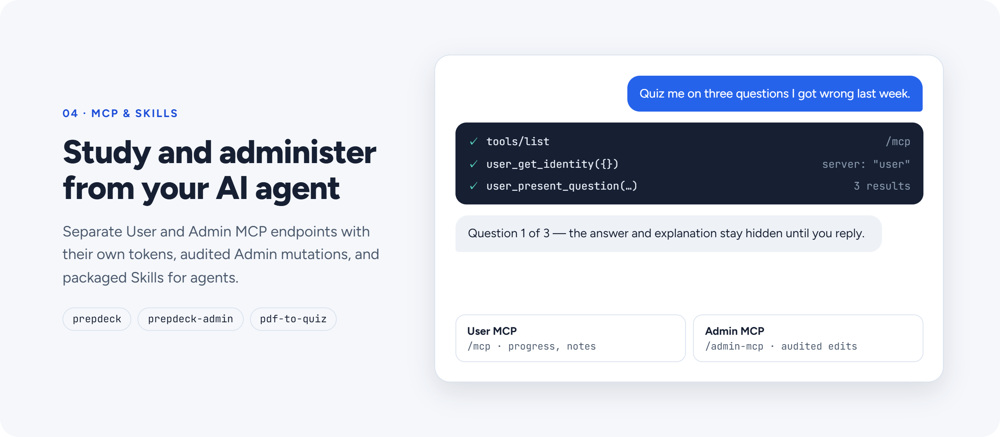
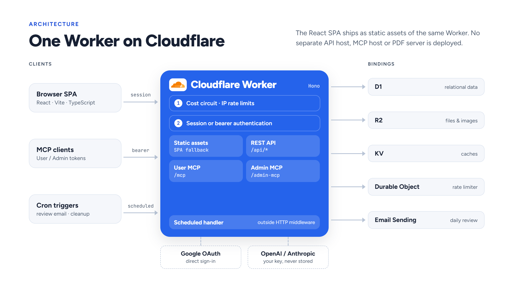

<p align="center">
  <a href="https://github.com/YIzhongyue/PrepDeck/actions/workflows/ci.yml"></a>
  <a href="https://m8ven.ai/mcp/yizhongyue-prepdeck-0kh85z"></a>
  <a href="LICENSE"></a>
</p>

PrepDeck is a self-hosted, multi-exam study platform for a small invited group. Build a question bank, practice at your own pace, take timed mock exams, and turn mistakes into notes you can revisit. Study in the browser or connect an AI agent through dedicated User and Admin MCP endpoints.

The whole application runs on one Cloudflare Worker, with D1, R2 and KV. Direct Google sign-in and an application-managed allow-list control membership. AI explanations use your own OpenAI or Anthropic key.

Explore the features · [Run locally](#quick-start) · [Architecture](#architecture) · [Documentation](docs/README.md) · [Contribute](.github/CONTRIBUTING.md)


## Practice your way

<picture>
  <source media="(prefers-color-scheme: dark)" srcset="docs/readme/practice-dark.png">
  
</picture>

Each exam has its own workspace, question bank and personal progress. Switch exams from the sidebar without losing your place, and pick the mode that suits the moment:

- **Practice** — untimed sessions filtered by domain, difficulty and source: every question, only unattempted ones, your bookmarks or your past mistakes. Get feedback after each answer or a summary at the end, skip back and forth freely, and stop whenever you like.
- **Mock exam** — a randomly drawn, timed run with a deadline the server enforces. Flag questions to revisit, step away and resume later, then review your score, pass or fail against the exam's pass mark, and a per-question breakdown.
- **Learning** — read through the bank in order with the correct answer, explanations and your own answer history already shown. Viewing never affects your statistics, and the next session offers to resume where you stopped.

Questions can be single-choice, multiple-choice, true/false, fill-in-the-blank, ordering or matching. Keyboard shortcuts and dedicated phone layouts keep sessions quick on any device. Notes and annotations stay hidden while you answer, so they cannot give the answer away. Questions an admin has flagged as **Under review** are marked, and you can skip them in any mode. When it is time to review, start a session from your wrong answers or bookmarks in one click.

## See where to focus next

<picture>
  <source media="(prefers-color-scheme: dark)" srcset="docs/readme/statistics-dark.png">
  
</picture>

The dashboard shows how each exam is going, with every figure clearly defined, so it never overstates how ready you are:

- **Readiness and coverage** — a difficulty-weighted readiness score, compared with the exam's pass line. Until you have answered enough questions, the dashboard shows bank coverage instead of an unreliable estimate.
- **Where to focus** — domains ranked by how far they fall below the pass line, each with a one-click session of the unseen and still-wrong questions behind it.
- **Trends and history** — accuracy over time, breakdowns by domain and difficulty, mock score history and an activity heatmap, all counted in your own time zone.
- **Wrong-question book** — how often each question was missed and when, filters by domain, and **Mark mastered** once a question is under control.
- **Study plan** — an optional exam-date countdown and weekly study-time goal, plus a daily review email at your preferred local hour.

## Build a library of Knowledge Points

<picture>
  <source media="(prefers-color-scheme: dark)" srcset="docs/readme/knowledge-points-dark.png">
  
</picture>

Capture the concepts behind the answers in a private library that spans every exam:

- **Write comfortably** — a visual editor stored as Markdown, with headings, tables, code blocks, pasted screenshots and Mermaid diagrams, plus Markdown source and preview modes when you want them.
- **Never lose an edit** — autosave shows its status as you type, and if the same note changes in another tab or on another device, you choose which version to keep.
- **Stay organized** — sort notes into groups, add overlapping tags, drag them into your own order, and search by title or body.
- **Connect notes to questions** — link one note to questions in any exam. A linked question opens in Learning, and Learning, Practice review and Mock results list the related notes, with a shortcut to create one for the current question.

For lighter review, highlight, underline or bold text in a question, its options or an AI explanation, and attach a short comment. Your marks are collected on a single review page. Question notes can stay personal or be shared with the group under your name, and anyone can hide notes shared by others. Knowledge Points and annotations are always private.

## Bring your AI agent into the workflow

<picture>
  <source media="(prefers-color-scheme: dark)" srcset="docs/readme/mcp-dark.png">
  
</picture>

Study with the AI agent you already use, backed by the same data and rules as the web app:

- **"Quiz me on ten questions I got wrong."** User MCP finds the questions and presents tables, code and images in their original form, keeping answers and explanations hidden until you respond. Ask it to record the session, and the server grades your answers and updates your statistics and wrong-question book.
- **"How am I doing, and what should I study next?"** Your agent reads the same progress figures as the dashboard and can suggest questions you have not tried or keep getting wrong.
- **"Turn this explanation into a Knowledge Point."** Create, tag, group and link personal notes without leaving the conversation.
- **"Find questions with missing explanations or duplicates."** Admin MCP adds question-bank quality checks, import validation and preview, and exam and tag management. Changes are previewed first, require explicit approval, are protected from overwriting newer edits and are recorded in an audit log.

| Connection | Endpoint | Access |
| --- | --- | --- |
| User MCP | `/mcp` | Questions, personal progress, practice recording and Knowledge Points. |
| Admin MCP | `/admin-mcp` | Question authoring, import review, exams and taxonomy. |

Clients that support MCP OAuth can connect with just the endpoint URL: sign in with Google and approve the access shown, then manage the connection under **Connected apps**. OAuth is available when the deployment enables it. Any other client can use a personal access token instead: create a User token in **Settings → MCP access**, or an Admin token in **Admin → MCP tokens**. **Copy setup prompt** in Settings produces connection instructions for your instance to hand to your agent. Follow the [MCP setup guide](docs/guides/mcp-and-skills.md) for connection details and secure credential handling.

Three companion Skills provide agent workflows:

- [**prepdeck**](skills/prepdeck/SKILL.md) — study, review progress and maintain personal Knowledge Points through User MCP.
- [**prepdeck-admin**](skills/prepdeck-admin/SKILL.md) — review and manage question-bank changes through Admin MCP.
- [**pdf-to-quiz**](skills/pdf-to-quiz/SKILL.md) — convert PDFs offline into import JSON and supporting evidence for admin review.

Skill installation and MCP access are separate. See the setup guide for packaged
downloads and the [Skill verification guide](docs/guides/skill-verification.md)
for checks.

## Explanations and question-bank tools

**AI explanations with your own key.** Generate explanations through OpenAI or Anthropic, or read explanations already cached for the group without supplying a key. Keys stay in browser memory by default, with optional passphrase-encrypted browser storage; the Worker relays them per request and never persists them server-side. Learning and Practice also offer **Copy as prompt** for use in your preferred AI tool. [How explanations work →](docs/requirements/ai-explanations.md)

**A shared bank with controlled editing.** Admins manage membership, author questions, review imports and inspect history. Revision checks protect edits against stale changes. The PDF conversion Skill prepares material offline before it is reviewed and imported. [Question authoring guide →](docs/guides/question-bank-authoring.md)

## Quick start

Use **Node.js 24** and **npm**. From the repository root:

```bash
npm ci
npm run dev:setup
npm run dev
```

Open **[localhost:8788](http://localhost:8788)**, choose **Sign in as local admin** or **Sign in as local user**, then select **Local practice examples**.

Setup builds the app, applies local database migrations, and seeds accounts and sample questions. The default environment simulates Cloudflare services locally; it needs no Cloudflare account, Google OAuth client, Docker or AI provider key. Local state survives restarts.

To start fresh, stop the app and run `npm run dev:reset`. This removes all local resource state and runs setup again. The [development guide](docs/guides/development-and-deployment.md) covers local accounts, resource inspection, simulated email, scheduled jobs and optional remote integrations.

## Architecture

<picture>
  <source media="(prefers-color-scheme: dark)" srcset="docs/readme/architecture-dark.png">
  
</picture>

The React SPA ships as static assets of the same Worker that serves the Hono API, both MCP endpoints and scheduled jobs. PDF conversion runs offline, so it needs no deployed processing service.

| Component | Responsibility |
| --- | --- |
| React, Vite and TypeScript | Browser application served as Worker static assets. |
| Hono on Cloudflare Workers | REST API, Google OAuth, MCP and scheduled handlers. |
| D1 | Questions, accounts, study records, notes and shared AI explanations. |
| R2 | Import files and images. |
| KV | Application caches. |
| Durable Objects and native rate limits | Request quotas and import limits. |
| Cron triggers and Email Sending | Review emails and scheduled cleanup. |

For a hosted instance, configure your Cloudflare resources, Google OAuth and deployment secrets, apply the ordered D1 migrations, then deploy the Worker and web assets. `npm run deploy` builds and deploys the application; it does **not** replace the migration step. Follow the [development and deployment guide](docs/guides/development-and-deployment.md) and [system overview](docs/architecture/system-overview.md) for the full setup. Infrastructure is designed for low cost; actual billing depends on your usage, enabled services and plan.

## Repository

| Path | Contents |
| --- | --- |
| [`apps/web`](apps/web) | React application and browser UI. |
| [`apps/worker`](apps/worker) | API, authentication, MCP servers and scheduled jobs. |
| [`packages/shared`](packages/shared) | Shared types, validation, grading and import contracts. |
| [`migrations`](migrations) | Ordered D1 schema migrations. |
| [`skills`](skills) | User, Admin and offline PDF conversion Skills. |
| [`docs`](docs/README.md) | Product behavior, architecture, guides and operations. |

## Documentation and contributing

| Start here | What you will find |
| --- | --- |
| [Documentation index](docs/README.md) | The complete project reference and interface examples. |
| [Development and deployment](docs/guides/development-and-deployment.md) | Local setup, service configuration and deployment. |
| [MCP and Skills](docs/guides/mcp-and-skills.md) | Agent connections, credentials and packaged workflows. |
| [Delivery status and roadmap](docs/requirements/future-enhancements.md) | Implemented behavior, remaining gaps and future work. |
| [Contributing](.github/CONTRIBUTING.md) | Contribution workflow and relevant validation checks. |
| [Security policy](SECURITY.md) | Private vulnerability reporting. |
| [Public/private repository workflow](docs/guides/public-private-sync.md) | Sanitized exports and reviewed one-way updates. |

Bug reports, documentation improvements and code contributions are welcome. Read the contributing guide before opening a pull request, and use the security policy for vulnerability reports.

## License and credits

PrepDeck is released under the [MIT License](LICENSE). See [Credits](CREDITS.md) for mascot artwork, visual assets and third-party code attribution.
