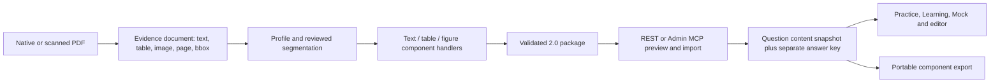

# Component questions and document import

[Documentation index](../README.md) · [Issue #16](https://github.com/YIzhongyue/PrepDeck/issues/16)

PrepDeck now represents long questions with reusable content blocks, shared
stimuli, one independently graded interaction per item, and separate scoring.
The executable [2.0 schema](../../skills/pdf-to-quiz/references/component-import.schema.json)
owns the contract; the [converter reference](../../skills/pdf-to-quiz/references/component-format.md)
owns commands, examples, limits and review gates. Existing 1.0 imports remain valid.

## Boundaries



These are three implemented layers, not a schema per exam or per book:

1. Content blocks and response/scoring contracts. Synthetic reading, programming,
   visual case and operation-combination fixtures exercise different domains.
2. Persistence, revision/conflict handling, portable inline assets, rendering,
   structured editing, attempts/grading and export. Shared stimulus IDs/revisions
   are resolved into immutable per-question snapshots; editing one item does not
   silently update other items. Export rejects conflicting snapshots with the
   same ID. Large inline catalogs bypass KV above its 25 MiB value limit.
3. Native/OCR evidence extraction, external provider profiles, optional Docling
   layout extraction, reviewed segmentation and reusable assembly handlers. The
   application/MCP catalog advertises content capabilities, not provider names.

[QTI 3](https://www.imsglobal.org/spec/qti/v3p0/impl) informed the separation of
stimulus, interaction and response processing. This is **not** QTI compliance or
QTI XML interoperability. [Docling](https://docling-project.github.io/docling/)
is an optional document parser, not an answer detector or grading engine.
Only exact scoring is implemented. A shared case with independent subquestions
is several items, while an answer selecting an operation combination is one item.

## Current-material verification

The following local check used the two supplied PDFs on 2026-09-22. Source books,
full extracted text, crops and reviewed imports remain under ignored `tmp/`;
committed fixtures and screenshots contain synthetic content only. These results
verify representative end-to-end behavior and expose extraction limits; they do
not certify an automatically converted full question bank.

| Check | Native collection (`layout1.pdf`) | Scanned textbook (`layout2.pdf`) |
| --- | --- | --- |
| Complete page extraction | 551 pages, one blank/failed page to review | 575 pages, one blank/failed page to review |
| Draft question inventory | 258 items / 258 answer entries (234 A, 24 B) | 111 / 120 expected paper questions; 99 answer entries after refinement |
| Draft structural validation | 0 structural issues; all still require source review | 20 reported issues (capped), missing questions/answers; full-book export blocked |
| Refined scan scope | Native text | 138 selected question/answer pages at 240 DPI; original OCR retained |
| Docling evaluation only | Pages 493–495, 516: 67 text, 3 table, 10 picture blocks; 15.64 s | Pages 443–445, 489: 96 text, 4 table, 2 picture blocks; 34.83 s |
| Reviewed B sample | Q13, physical pages 492–493: two typed tables, nine combination options, key ク | Mock Q49, physical pages 443–444 + key 489: two retained source crops, six options, visually verified key カ |
| Source-gated export | 1 item; 2/551 pages reviewed; `completeBookReview: false` | 1 item; 3/575 pages reviewed; `completeBookReview: false` |
| Local API round trip | REST preview → SQLite/D1-compatible import → export → repeat import skips → correct server grading; MCP preview/execute/replay/export | Same; image bytes and stimulus content unchanged |

Docling 2.129.0 ran locally on CPU with two threads and Tesseract; durations are
single warm-environment observations, not a general benchmark. It recovered
structured tables useful to the native sample, while scan OCR still confused
カ with 力 and other characters. Prefer native extraction where usable; use the
structured adapter for difficult layouts, then review source pixels. The scan's
chapter examples are reference scopes and are not included in its 120-paper-item
expectation. Missing exam candidates must be repaired or explicitly inventoried
as unresolved; never lower expected counts to approve the OCR survivors.

Reproduce reviewed local API verification (only when the local imports exist):

```bash
COMPONENT_SOURCE_FILES=/absolute/native/reviewed.json,/absolute/scanned/reviewed.json \
  node --test apps/worker/scripts/question-authoring.test.mjs
COMPONENT_SOURCE_FILES=/absolute/native/reviewed.json,/absolute/scanned/reviewed.json \
  node --test --test-name-pattern="component " apps/worker/scripts/mcp-foundation.test.mjs
```

The same test always runs the four committed synthetic fixtures without this
environment variable. MCP tests additionally cover preview/execute/replay/export;
browser tests cover actual provider state, restored ordering/matching drafts,
image/table/code rendering, component import preview/edit/export and mobile UI.
See [synthetic screenshots](../screenshots/component-questions.md).

## Limits and follow-up

Inline raster assets make a bounded portable first implementation; large banks
need batches. Source PDFs are not uploaded or parsed by the Worker. A future
object-storage asset protocol can replace inline transport without changing the
logical block reference model. Merged table cells, nested/composite interactions,
partial credit, QTI interchange, component inline annotations and graphical block
editing are not implemented. The current JSON editor exposes the complete model.
AI explanations/search/email continue to use text projections, so figure-only
content may require a textual description for those consumers; the question UI
and component-aware MCP records retain the image. No production migration or
production import was performed during this verification.
