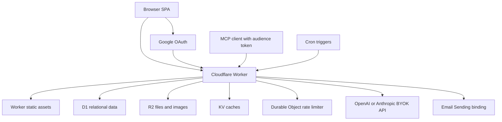

# System architecture

[Documentation index](../README.md)

## Runtime and boundaries

[wrangler.toml](../../apps/worker/wrangler.toml) deploys one Worker with the built
React/Vite SPA in `[assets]`. Worker-first routing covers `/api/*`, `/mcp` and
`/admin-mcp` including subpaths; other asset paths use SPA fallback. Cloudflare
Pages is an earlier architecture, not the checked-in deployment. No separate
MCP host or PDF-processing server is deployed.

[index.ts](../../apps/worker/src/index.ts) mounts cost circuit and IP limits before
authentication on API/MCP paths. Browser auth then resolves its session and account;
User/Admin MCP validates independent bearer credentials before protocol dispatch.
Google OAuth, health and signed unsubscribe are deliberately separate entry points.
Static assets are not a private-data authorization boundary.

The SPA uses screen state and supported query parameters rather than a general
nested URL router. The Admin screen is role-gated; `/admin-mcp` is a protocol
endpoint and must not be confused with Admin UI navigation.

## Storage and services

D1 owns relational state. [Migrations](../../migrations) and
[data contracts](../requirements/data-model-and-import-format.md) define ownership.
R2 holds import JSON, avatars/provider icons/exam badges and private Knowledge Point
images, served through appropriate application routes. Source PDFs are processed
outside the app by [pdf-to-quiz](../../skills/pdf-to-quiz/SKILL.md); there is no
general source-PDF upload/archive feature.

REST and MCP share validated services for learning, questions, imports and
Knowledge Points. Keep identity in the authenticated context, not tool arguments.
MCP proposal/revision/audit semantics live in [MCP architecture](mcp.md).

## Caches

| Cache | Key scope | Expiration / invalidation |
| --- | --- | --- |
| Browser authorization row | User ID and email | 600 seconds; role/status/profile edits delete keys. KV propagation can leave stale authorization. |
| Access JWKS | Access signing keys | One hour; only relevant to optional Access auth. |
| Statistics | User + exam + payload schema version | One hour; attempt completion invalidates. A payload cached under an older schema version is never served, so adding response fields needs no migration. |
| Practice question catalog | Exam only | One hour; bank mutations invalidate. Personal collections are queried separately. |
| AI explanations (D1) | Question + provider + model | Content-changing question edits invalidate; generation inserts are revision-bound. |

See [user cache](../../apps/worker/src/lib/userCache.ts),
[stats cache](../../apps/worker/src/lib/statsCache.ts),
[catalog cache](../../apps/worker/src/lib/practiceCache.ts) and
[AI behavior](../requirements/ai-explanations.md). KV is never the system of record
or an atomic rate-limit counter. Cache refreshes/invalidation still consume quota;
ten users alone does not prove a deployment stays inside its plan.

## Background work and failure boundaries

[Scheduled jobs](../operations/scheduled-jobs.md) send daily review email and clean
abandoned images. They are separate invocations and do not pass through HTTP
circuit middleware. HTTP emergency mode therefore does not automatically stop
scheduled storage/email work. D1 transactions cannot atomically commit an R2 write
or provider send; document partial outcomes and retry rules in each workflow.

Use [cost containment](../operations/cloudflare-cost-containment.md),
[rate limits](../operations/cloudflare-rate-limits.md) and
[observability](../operations/observability-runbook.md) for operational controls.
Those documents distinguish code from account-side configuration and planned
monitoring; repository settings alone cannot verify a running account's controls.
