# Page breadcrumbs

[Documentation index](../README.md)

Synthetic fixture captured on 2026-09-27 in the real application shell at
1280×800, cropped to each page's header. The fixture has three made-up
questions, one bookmark and one wrong answer. No real exam content is shown.
The "before" images are from `master` at `0a35a13`.

Each Study and Resources page used to open with its own kicker. The setup
screens had an icon kicker ("Learning mode"), the lists had an uppercase
eyebrow ("Saved", "Targeted review"), and Knowledge points had a "Personal
library · Available across all exams" line as well. Mock's live screen had no
such row. Every page now opens with the same breadcrumb: the sidebar section,
then the page, with the page's nav icon.

| | Before | After |
|---|---|---|
| Learning setup | 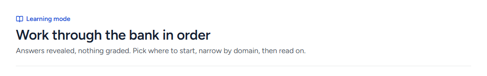 | 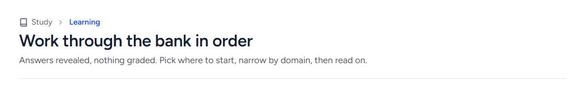 |
| Practice setup | 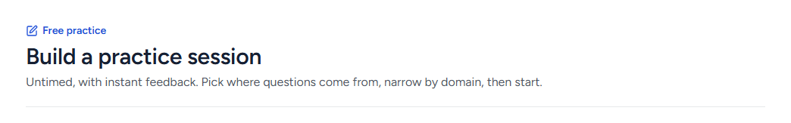 | 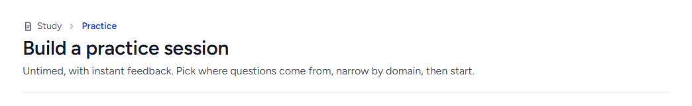 |
| Mock setup | 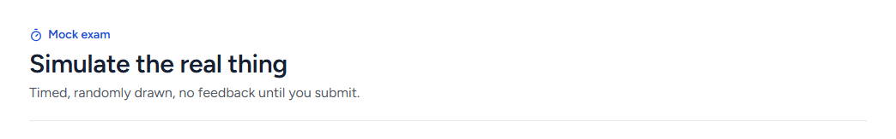 | 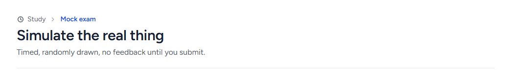 |
| Knowledge points | 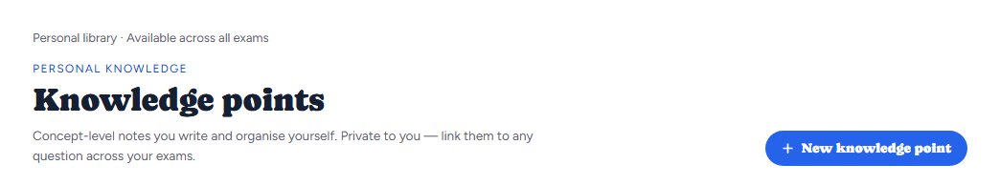 | 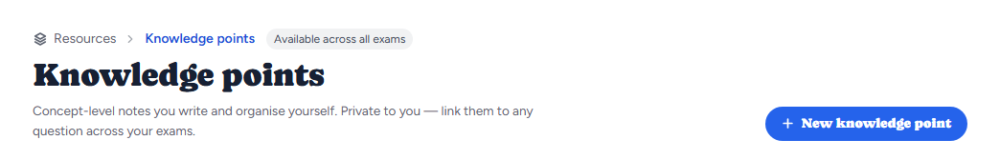 |
| Bookmarks | 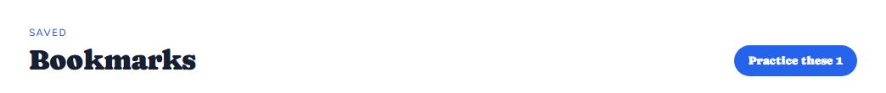 | 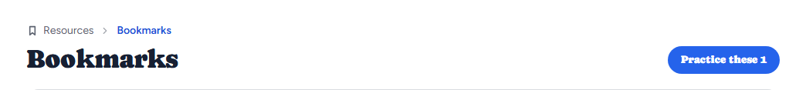 |
| Wrong questions | 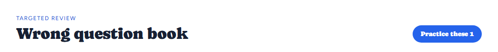 | 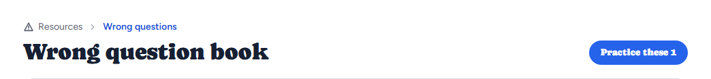 |
| Annotations |  | 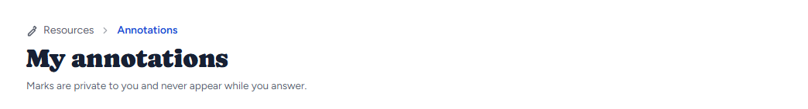 |
| Learning session | 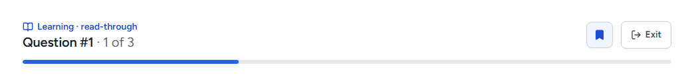 | 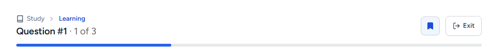 |
| Practice session | 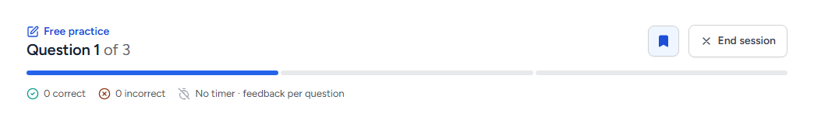 | 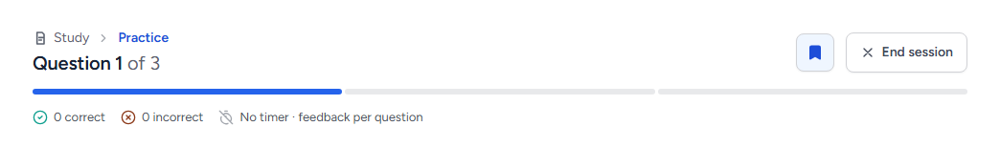 |
| Mock session | 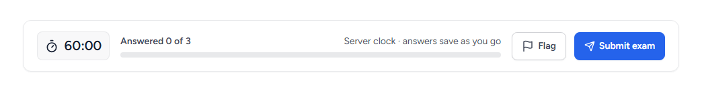 | 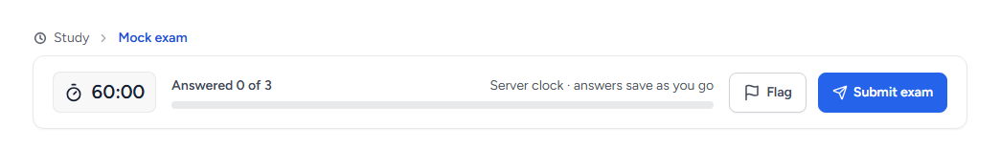 |

In the Dusk scheme the section stays muted and the page takes Dusk's accent:

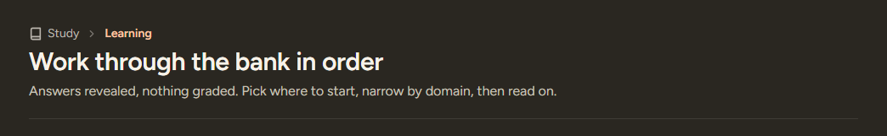

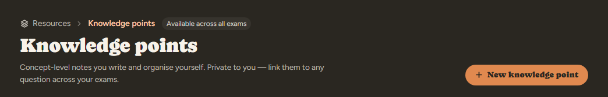

At 390px the row wraps, and Knowledge points' pill moves to a second line.
During a Learning, Practice or Mock session a phone shows no breadcrumb,
because the top bar already names the mode.

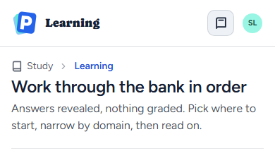 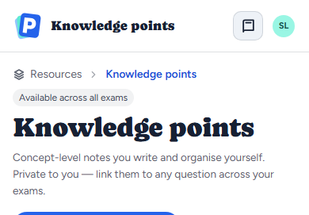
