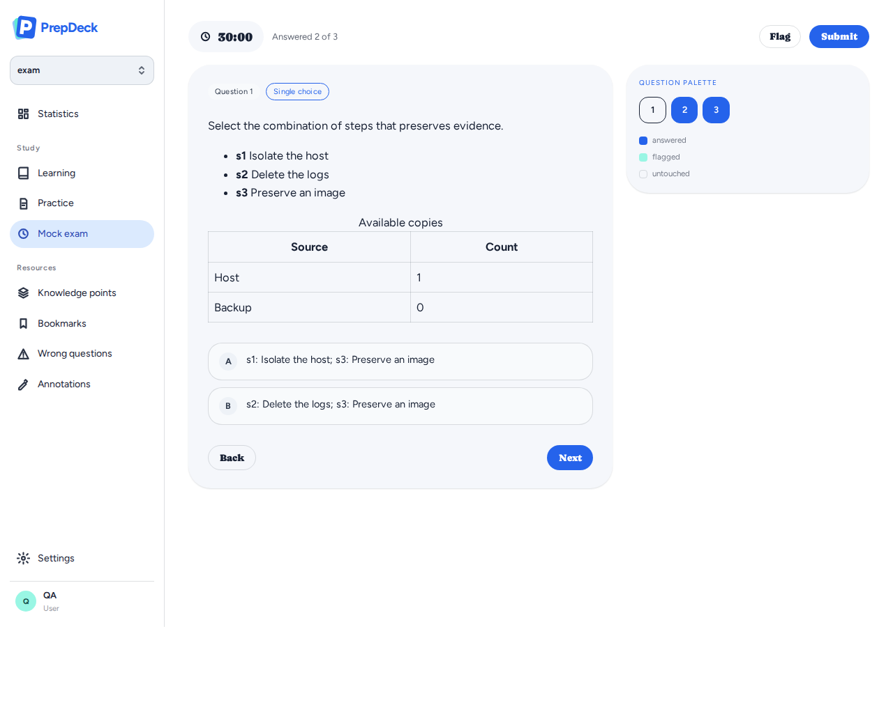
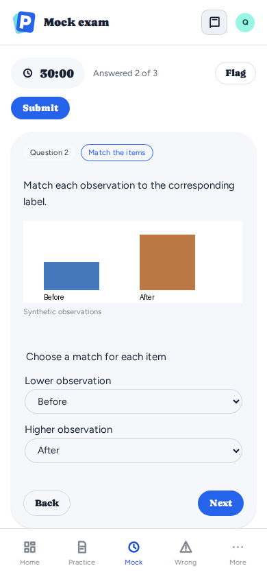
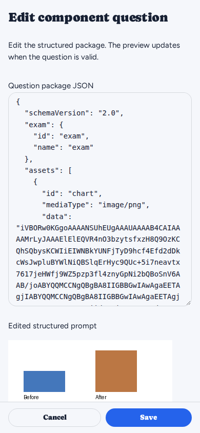

# Component question UI verification

[Documentation index](../README.md) · [Architecture and source validation](../architecture/component-questions.md)

Synthetic fixtures only; no source-book pages, account data or credentials.
Captured from actual React components and provider state by the authoring and
answer-state browser regressions on 2026-09-22. Browser tests also verify desktop
and 390px mobile layouts, image decoding, order/match selections restored after
reload, import preview, revision-checked editing, preserved assets and export.

## Desktop: operation combinations and a table

## Mobile: figure and matching interaction

## Mobile: structured question editor

The complete package, including inline assets, is editable as JSON with a live
preview. A graphical block editor is future work.

Regenerate screenshots with `SCREENSHOT_DIR` set when running
`node apps/web/scripts/question-authoring.browser.mjs` and
`node apps/web/scripts/answer-state.browser.mjs`. CI retains screenshots as a
`browser-screenshots` artifact. The fixtures use isolated HTTP services and never
write to a production question bank.
