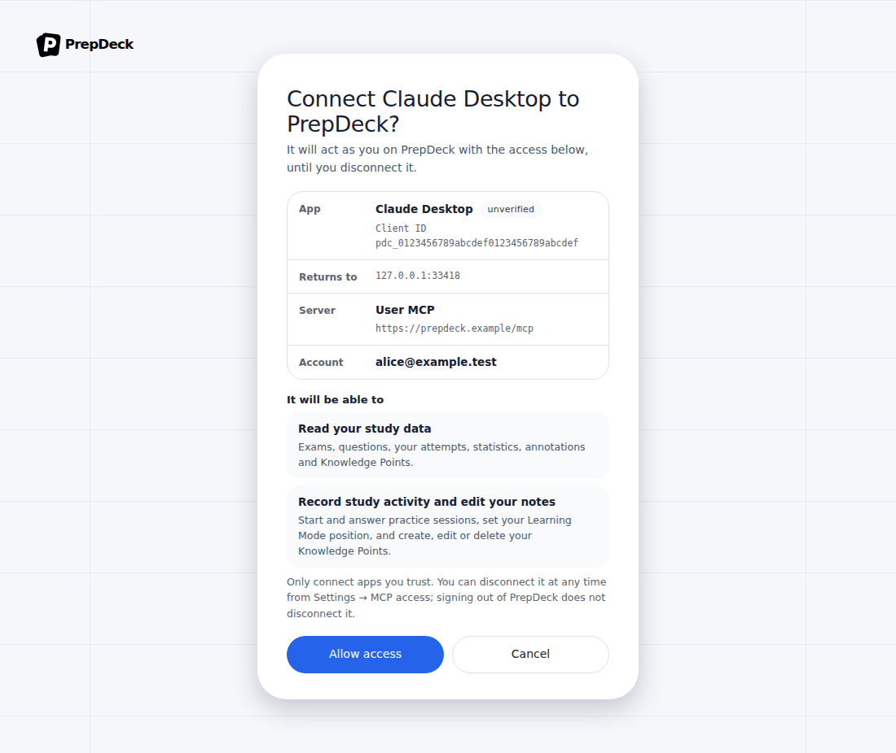
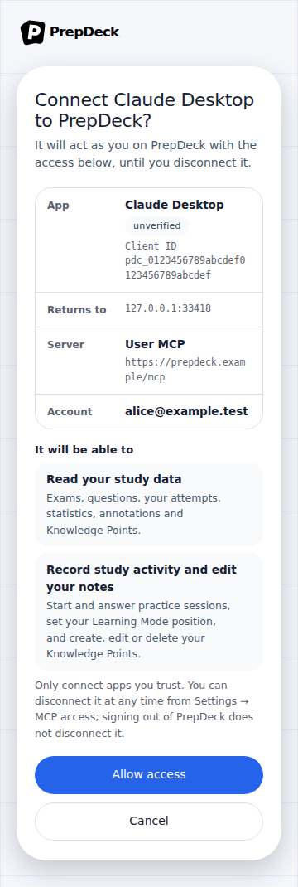
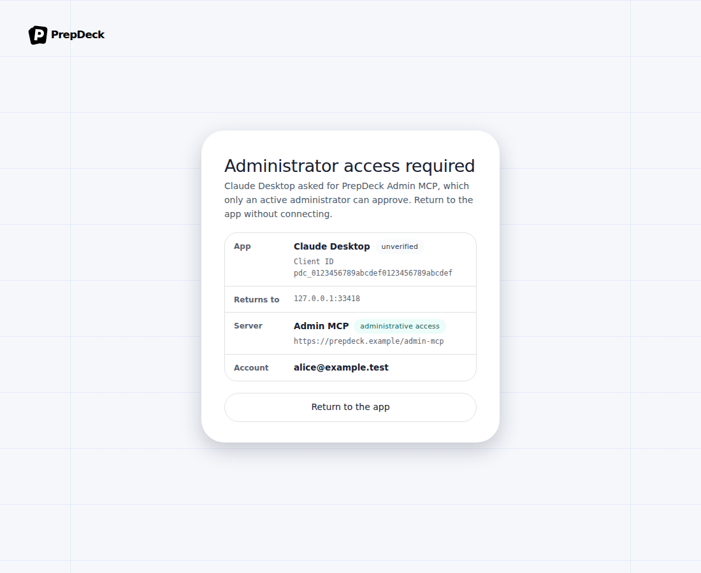
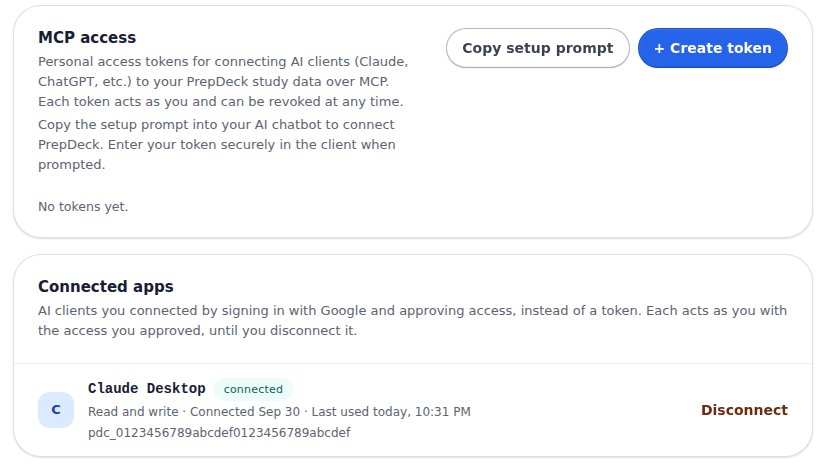

# MCP OAuth consent and connected apps

[Documentation index](../README.md)

Captured on 2026-10-01 from the real components with synthetic fixture data (one
made-up account, client and connection); no deployment was contacted.
[FR-1.12](../requirements/authentication-and-users.md#fr-1-12) and
[MCP architecture](../architecture/mcp.md#oauth-authorization-issue-102) describe
the behavior. These screens are new; there is no "before".

The consent screen an OAuth-capable MCP client opens (`/connect`), after the
ordinary Google sign-in. The app's name is self-asserted and marked unverified;
the screen shows where the browser returns, which MCP server, each permission
and the signed-in account:

At phone width:

An Admin MCP request seen by an account that is not an active administrator
offers no approval, only a way back to the app:

Settings → AI & integrations: connected apps sit next to, and apart from, the
personal access tokens, and can be disconnected. The Admin console shows the
same card for Admin MCP connections.

