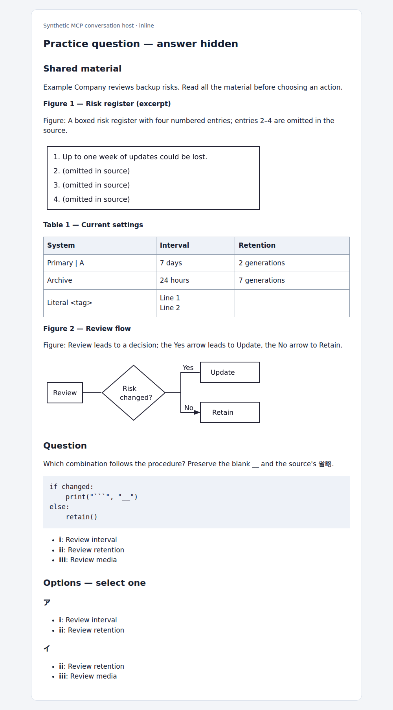
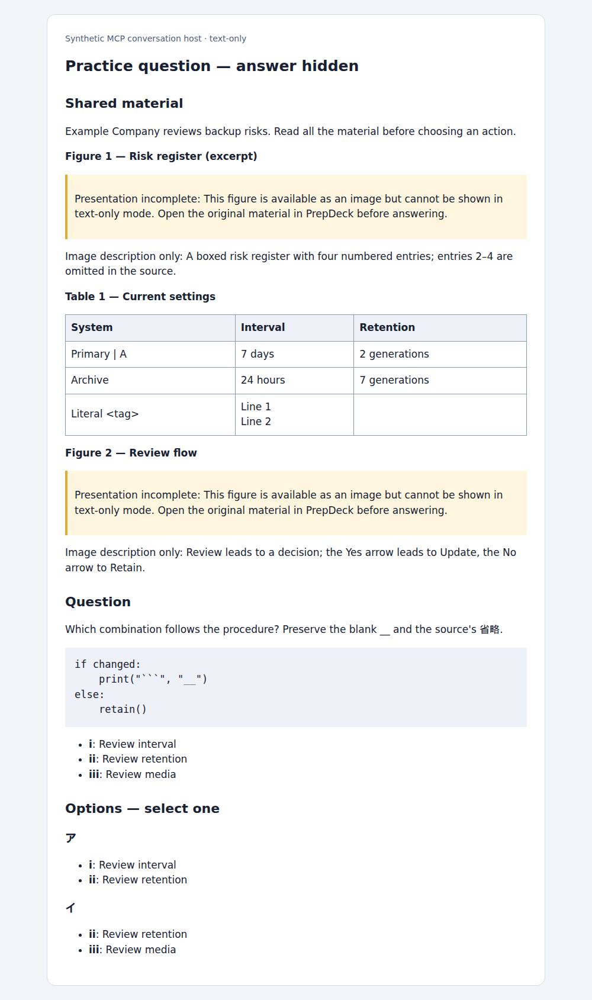

# MCP question presentation verification

[Documentation index](../README.md) · [MCP contract](../architecture/mcp.md#quiz-presentation)

Synthetic examples captured on 2026-09-23. No exam-book pages, accounts or
credentials are included. The fixture uses a boxed risk register comparable in
structure to the reported SG Q54 figure, a two-branch flowchart, a rectangular
table (including a literal pipe, blank cell and multiline cell), pseudocode and
combination options. Its retained PNGs contain the box, original omission markers
and arrows; the presenter passes those bytes unchanged as MCP images.

These screenshots render the actual `user_present_question` presenter output in
a minimal GFM/image host. They verify visible output without relying on a model
to reconstruct the source. They do **not** certify a particular chatbot host or
guarantee that a model will follow the instructions. Existing incorrectly
flattened records still require source review; this change does not repair them.

## Image-capable host

The box and flowchart remain images, Table 1 remains a table with all cells, and
the code keeps indentation and embedded backticks. Source labels and combination
members remain unchanged. No grading key, explanation or annotation is returned.



## Text-only host

The same table/code remain usable. Both figures are explicitly unavailable in
this mode, with descriptions labeled as descriptions. Metadata reports
`status: incomplete`; the study instructions require source review before asking
for an answer or grading. A missing asset produces a separate explicit warning,
not a broken image or a fabricated replacement list.



Reproduce with:

```sh
SCREENSHOT_DIR=docs/screenshots node apps/web/scripts/mcp-presentation.browser.mjs
node --test apps/worker/scripts/mcp-presentation.test.mjs apps/worker/scripts/mcp-foundation.test.mjs
```

The browser regression is included in `npm run test:browser`; `SCREENSHOT_DIR`
also supports CI artifact capture. Assertions check rendered table cell values,
caption text, code text, option labels, image decoding/dimensions and both missing
asset and text-only fallbacks. Worker integration tests exercise both supported
SDK transports, exam scoping, metadata, no bank writes and omission of grading
columns. Unit cases additionally cover legacy Markdown across exams, repeated
images, invalid snapshots/tables/references, and matching/ordering interactions.
