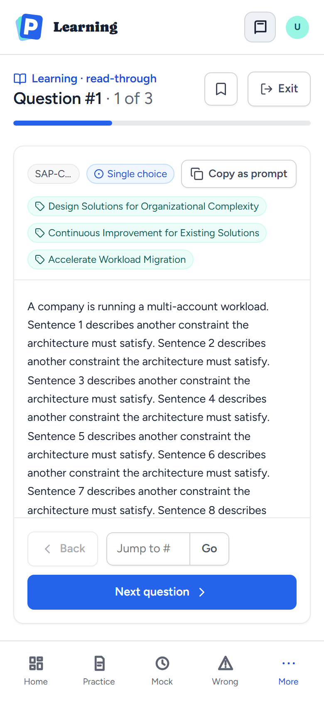
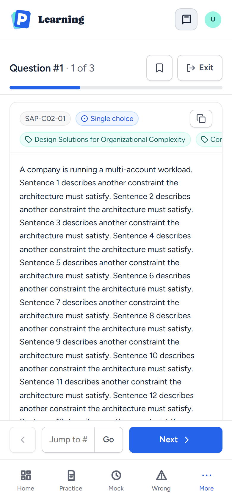
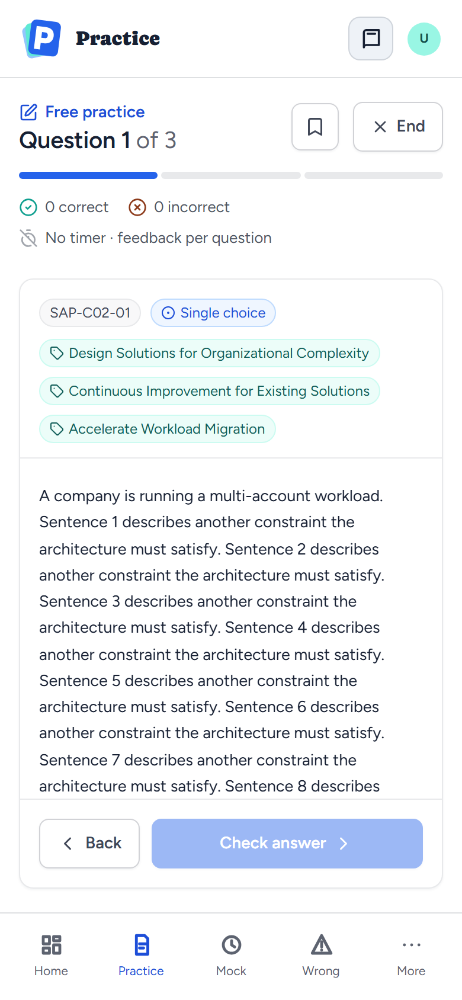
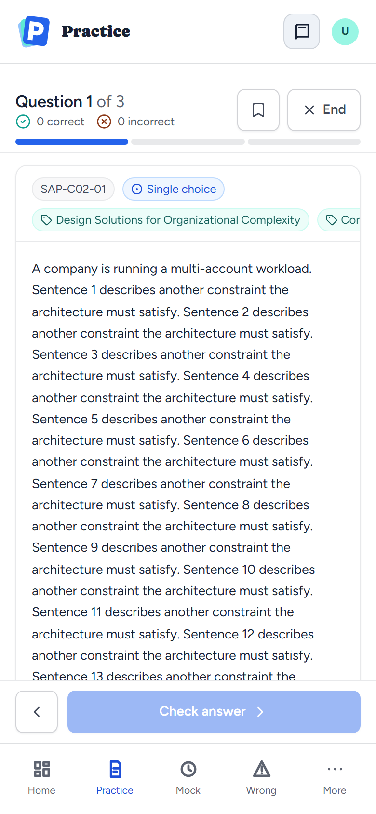
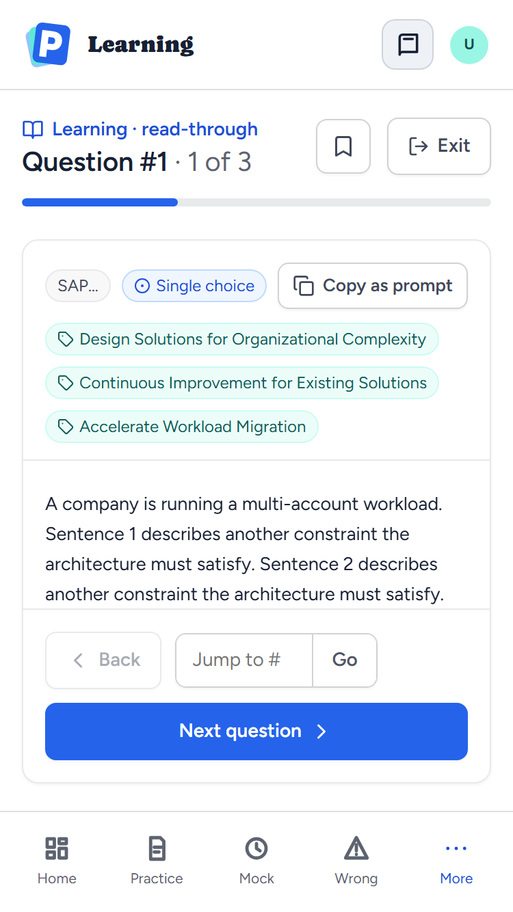
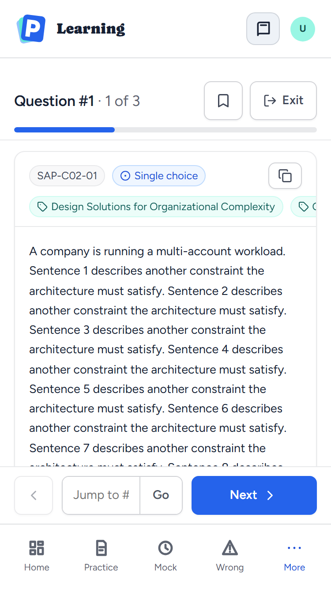
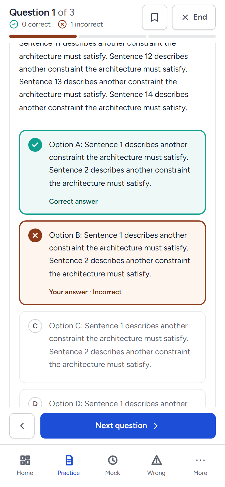

# Phone question layout

[Documentation index](../README.md) · [Practice and Learning modes](../requirements/practice-and-learning-modes.md#fr-3-2)

Synthetic fixture captured on 2026-09-27 in the real application shell at
390×844 (iPhone 14) and 375×667 (iPhone SE). The question is a long made-up
scenario with three domain tags. No real exam content is shown. The "before"
images are from `master` before
[issue #78](https://github.com/YIzhongyue/PrepDeck/issues/78).

On phones, Learning and Practice used to pin the question card to the space
left between the top bar, the session header and the tab bar. The stem then
scrolled inside the card, in as little as 108px on an iPhone SE. Now the page
scrolls as one. A compact session header sticks to the top once the top bar
has scrolled away, and Back and Next or Check answer stick just above the tab
bar. Tags keep to one row that scrolls sideways.

| | Before | After |
|---|---|---|
| Learning, 390×844 |  |  |
| Practice, 390×844 |  |  |
| Learning, 375×667 |  |  |

Scrolled through a graded Practice question, the session header and the
actions stay in place:



`apps/web/scripts/question-card-layout.browser.mjs` checks at 390px that only
the page scrolls, the header and actions stick, the tags keep to one focusable
row, a new question starts below the header, and an option scrolled into view
stops clear of both bars. `apps/web/scripts/exam-workspace.browser.mjs` checks
at 375px that the actions sit on the tab bar while the page scrolls. With
`QUESTION_CARD_SCREENSHOTS` set, the first suite writes a capture of each
screen at every width it tests:

```sh
QUESTION_CARD_SCREENSHOTS=docs/screenshots node apps/web/scripts/question-card-layout.browser.mjs
```
