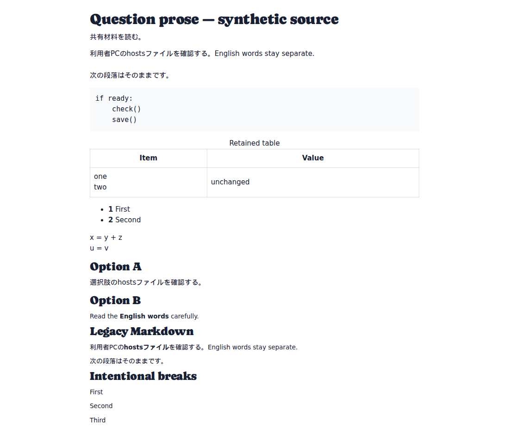
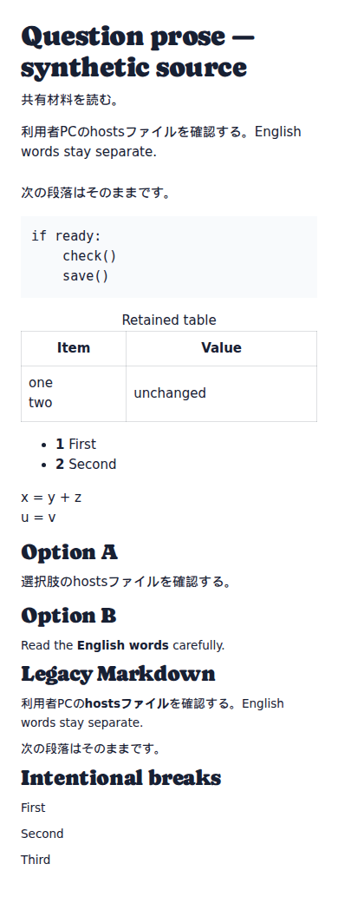

# Question prose reflow verification

[Documentation index](../README.md) · [Rendering and source-coordinate contract](../architecture/component-questions.md#prose-layout-and-stored-coordinates)

Synthetic examples captured on 2026-09-23. The fixture recreates an extraction
line ending inside `hostsファイル`, mixed English/Japanese text and ordinary
paragraph boundaries. It uses the actual shared question renderers for shared
material, stems, options and legacy Markdown. No source-book pages are included.





The browser regression asserts that the split Japanese word occupies one line
when there is room, English words retain spaces, and the narrow layout reflows
without horizontal overflow. It checks intentional paragraphs/hard breaks,
multiline cells, lists, equations, code indentation and unchanged input content.
The annotation regression separately tests persisted marks across Latin and CJK
layout line endings, source-offset selection capture, hide/reveal, deletion and
legacy-to-component export/import.

```sh
mkdir -p docs/screenshots
SCREENSHOT_DIR=docs/screenshots node apps/web/scripts/component-annotations.browser.mjs
node --test apps/web/scripts/prose.test.mjs
```

The annotation browser suite runs `question-prose.browser.mjs` automatically in
CI. The latter can also run independently. The renderer deliberately avoids
rewriting ambiguous preformatted content; see the linked contract for limits.
