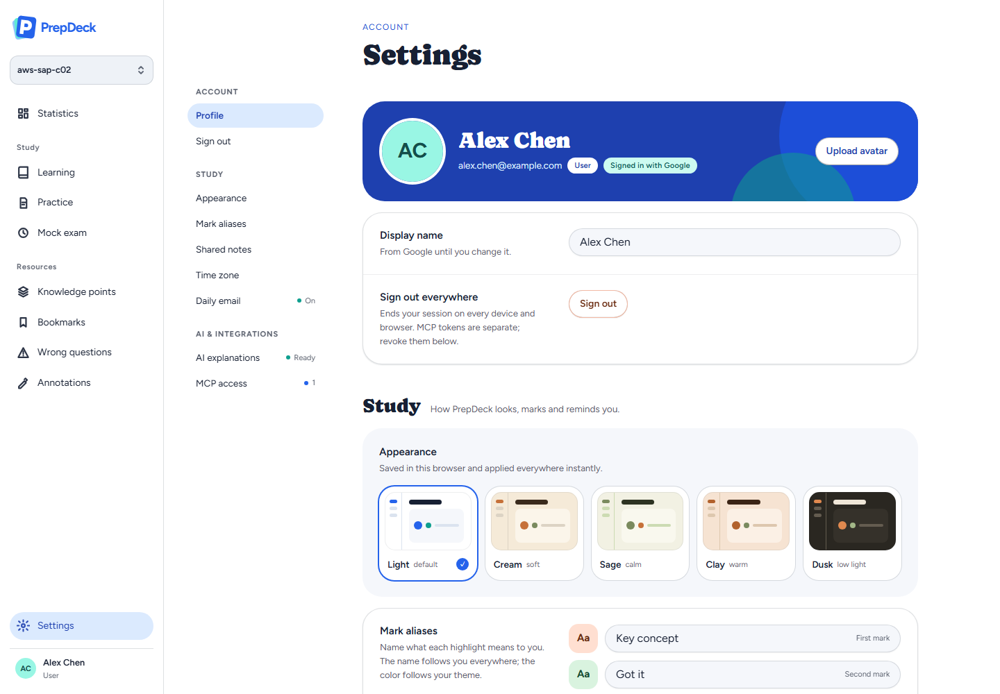
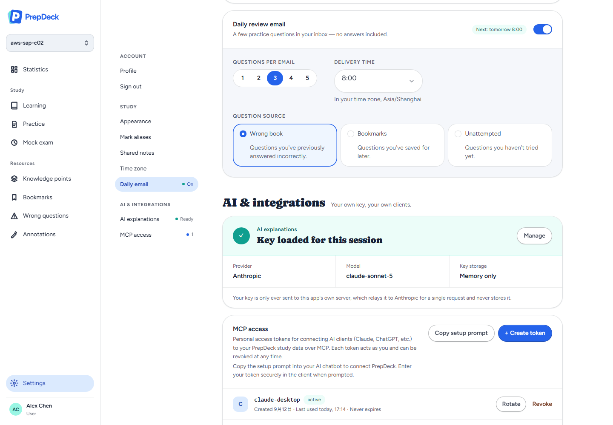
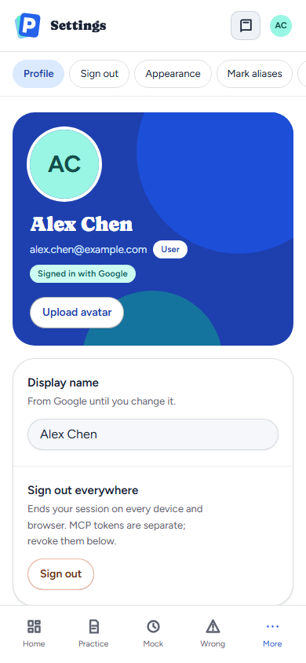
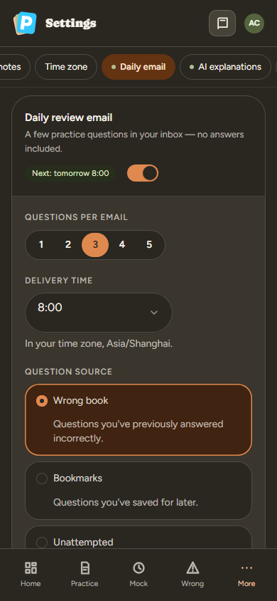

# Settings layout

[Documentation index](../README.md) · [Shared UI components](../guides/ui-components.md)

Synthetic account captured on 2026-09-27 in the real application shell, at the
design's 1440px desktop and 390px phone widths. The fixture has the daily email
on, an AI key loaded for the session and one active and one revoked MCP token.
No real account data is shown.

Settings is one page in three groups: Account, Study, and AI & integrations.
On wide screens a sticky index beside the content follows the scroll position
and shows each section's state (daily email on or off, AI key ready, active MCP
tokens). On narrow screens a sticky row of chips under the top bar does the same.









`apps/web/scripts/settings.browser.mjs` checks the section index (jump, focus,
scroll tracking, chips on phones), the profile card's contrast in all five
schemes, and that nothing overflows at 1280px and 375px. With
`SETTINGS_SCREENSHOTS` set it also writes full-page captures of every scheme:

```sh
SETTINGS_SCREENSHOTS=docs/screenshots node apps/web/scripts/settings.browser.mjs
```
