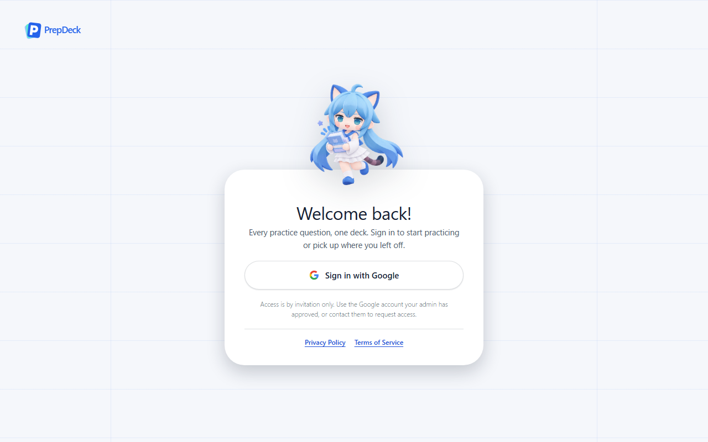
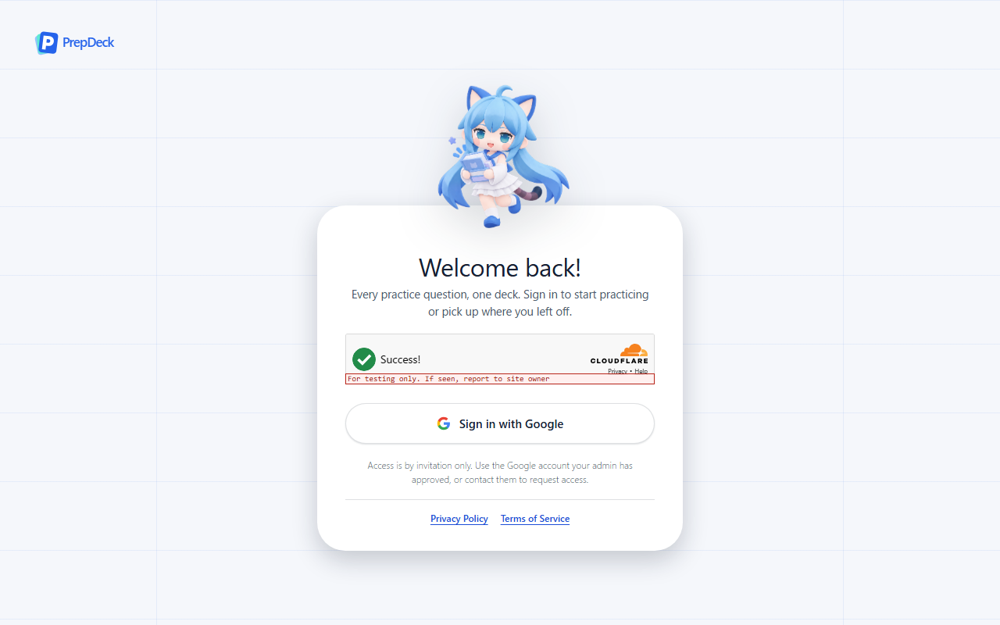
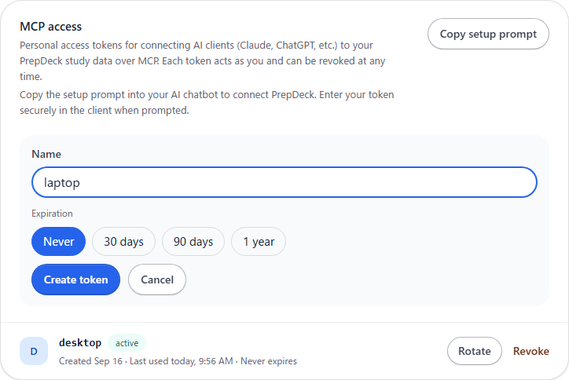
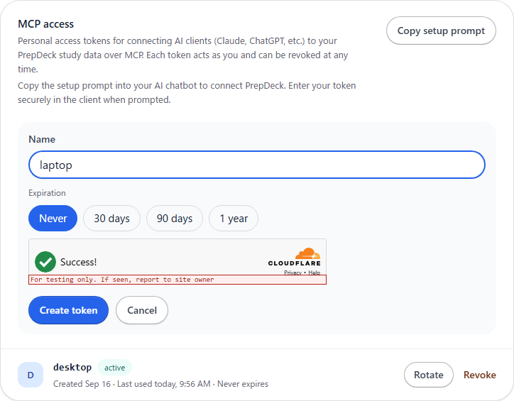
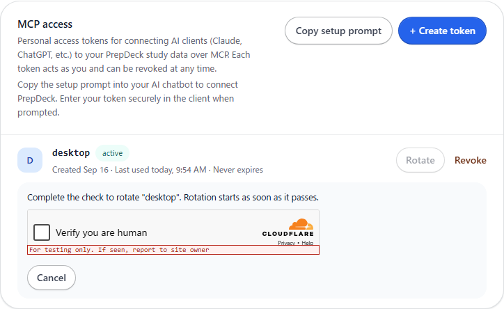
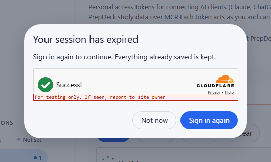
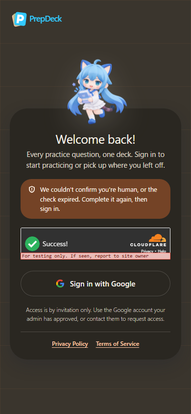

# Human verification (Turnstile)

[Documentation index](../README.md)

Captured on 2026-09-28 from the production web build, served under its content
security policy with a synthetic fixture API: one made-up account and one MCP
token. The widget is Cloudflare's real Turnstile, rendered with Cloudflare's
public test site keys, which is why it carries the red "For testing only"
label; a real site key shows no label. "Before" is the same build with no site
key, which renders exactly as `master` at `0345507`.
[FR-1.11](../requirements/authentication-and-users.md#fr-1-11) describes the
behavior.

| | Before | After |
|---|---|---|
| Login |  |  |
| Creating an MCP token |  |  |

The Google button and Create token stay disabled until the check passes. In
Managed mode that is usually automatic, as above.

Rotating a token shows the check in the token's row, and rotation starts as
soon as it passes. This test key always asks for an interactive challenge:

When the session ends in use, the sign-in-again dialog asks for the same check:

A refused or expired check returns to the login screen with a notice. Dusk gets
Turnstile's dark widget, and a card narrower than 300px its compact one; at
390px the flexible widget still fits:

